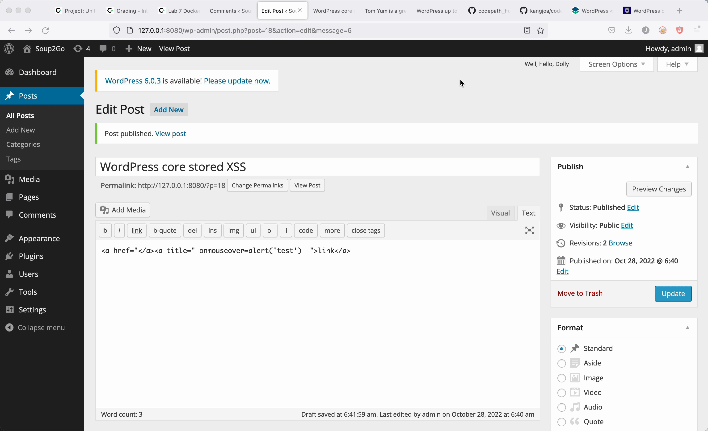

# WordPress Pen Testing

Time spent: 24 hours spent in total

> Objective: Find, analyze, recreate, and document **three vulnerabilities** affecting an old version of WordPress


## Pen Testing Report

### 1. (Required) CVE-2015-3438
- [ ] Summary: An attacker is able to insert html in a comment that affects the html of the page unexpectedly.
  - Vulnerability types: Unauthenticated Stored Cross-Site Scripting (XSS)
  - Tested in version: 4.1.0
  - Fixed in version: 4.1.2
- [ ] GIF Walkthrough: 
- [ ] Steps to recreate: First post a comment with html that affects the wordpress site's html. In the .gif, I used "< abbr title='Web𝌆log'>blog!</abb r>" . Then as an admin, approve the seemingly innocuous comment. However, as explained in source link 4, "This comment effectively breaks the well-formedness of the HTML page, since the closing quote and tag token are not there." With a comment, a user can break the html on the Wordpress page.
- [ ] Affected source code:
  - [Link 1](https://wpscan.com/vulnerability/604b553d-5492-4f8c-af7a-db7169780032)
  - [Link 2](https://cve.mitre.org/cgi-bin/cvename.cgi?name=CVE-2015-3438)
  - [Link 3](https://wordpress.org/news/2015/04/wordpress-4-1-2/)
  - [Link 4](https://cedricvb.be/post/wordpress-stored-xss-vulnerability-4-1-2/)
  
### 2. (Required) CVE-2015-5622

- [ ] Summary: Cross-site scripting (XSS) vulnerability in WordPress before 4.2.3 allows remote authenticated users to inject arbitrary web script or HTML by leveraging the Author or Contributor role to place a crafted shortcode inside an HTML element.
  - Vulnerability types: Authenticated Stored Cross-Site Scripting (XSS)
  - Tested in version: 4.1.0
  - Fixed in version:4.1.6
- [ ] GIF Walkthrough: 
- [ ] Steps to recreate: Log in as a Contributor or Author and inject HTML. The HTML mouseover could cover the "whole browser window to force execution of the onmouseover code" (from link 3 in sources).
- [ ] Affected source code:
  - [Link 1](https://wpscan.com/vulnerability/0f027d7d-674b-4a63-9603-25ea68069c1d)
  - [Link 2](https://cve.mitre.org/cgi-bin/cvename.cgi?name=CVE-2015-5622)
  - [Link 3](https://klikki.fi/adv/wordpress3.html)

### 3. (Required) CVE-2017-6817

- [ ] Summary: HTML sanitization still allows escape sequences to work and an attacker is able to insert certain html tags and embed malicious shortcode.
  - Vulnerability types: Authenticated Stored Cross-Site Scripting (XSS)
  - Tested in version: 4.1.0
  - Fixed in version: 4.1.16
- [ ] GIF Walkthrough: 
- [ ] Steps to recreate: Log in as an authenticated user, create a post and add an embedded Youtube URL including escape sequences. Publish and view the post to see the script executed. Example of embed tag: 
- [ ] ```[embed src='https://youtube.com/embed/12345\x3csvg onload=alert(10101010)\x3e'][/embed]```
- [ ] Affected source code:
  - [Link 1](https://wpscan.com/vulnerability/3ee54fc3-f4b4-4c35-8285-9d6719acecf0)
  - [Link 2](https://cve.mitre.org/cgi-bin/cvename.cgi?name=CVE-2017-6817)
  - [Link 3](https://blog.sucuri.net/2017/03/stored-xss-in-wordpress-core.html)

### 4. (Optional) Vulnerability Name or ID

- [ ] Summary: 
  - Vulnerability types:
  - Tested in version:
  - Fixed in version: 
- [ ] GIF Walkthrough: 
- [ ] Steps to recreate: 
- [ ] Affected source code:
  - [Link 1](https://core.trac.wordpress.org/browser/tags/version/src/source_file.php) 

### 5. (Optional) Vulnerability Name or ID

- [ ] Summary: 
  - Vulnerability types:
  - Tested in version:
  - Fixed in version: 
- [ ] GIF Walkthrough: 
- [ ] Steps to recreate: 
- [ ] Affected source code:
  - [Link 1](https://core.trac.wordpress.org/browser/tags/version/src/source_file.php) 

## Assets

List any additional assets, such as scripts or files

## Resources

- [WordPress Source Browser](https://core.trac.wordpress.org/browser/)
- [WordPress Developer Reference](https://developer.wordpress.org/reference/)

GIFs created with  ...
<!-- Recommended GIF Tools:
[Kap](https://getkap.co/) for macOS
[ScreenToGif](https://www.screentogif.com/) for Windows
[peek](https://github.com/phw/peek) for Linux. -->

## Notes

Describe any challenges encountered while doing the work:

I had a difficult time completing this assignment using Docker. However, I did figure it out after a lot of time. I deleted so many things trying to make a new Wordpress site after losing my password and not being able to recover it. I was eventually able to delete a volume in Docker and was able to create a new Wordpress site with a new password that I saved this time. 
