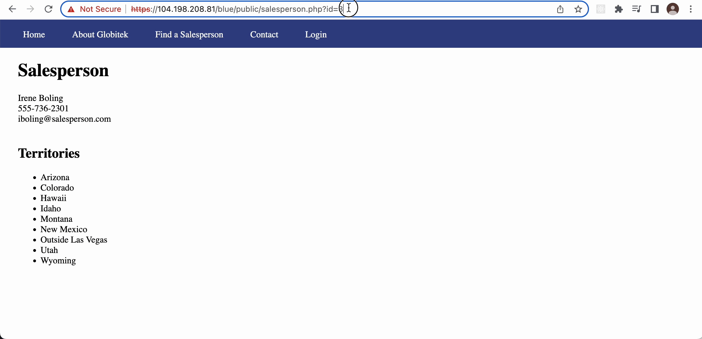
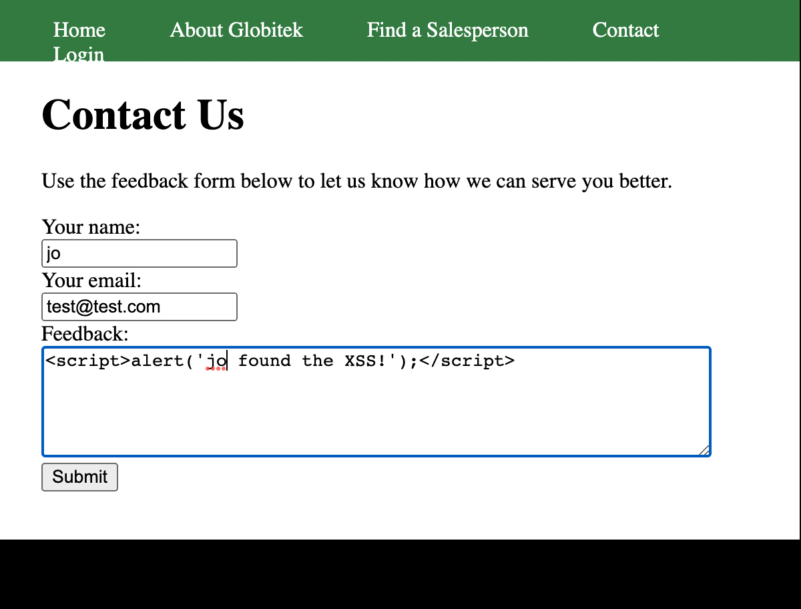
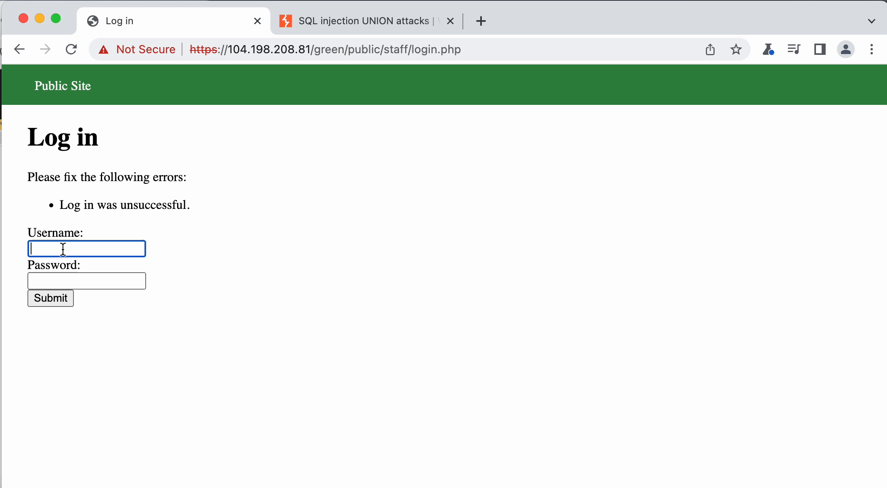
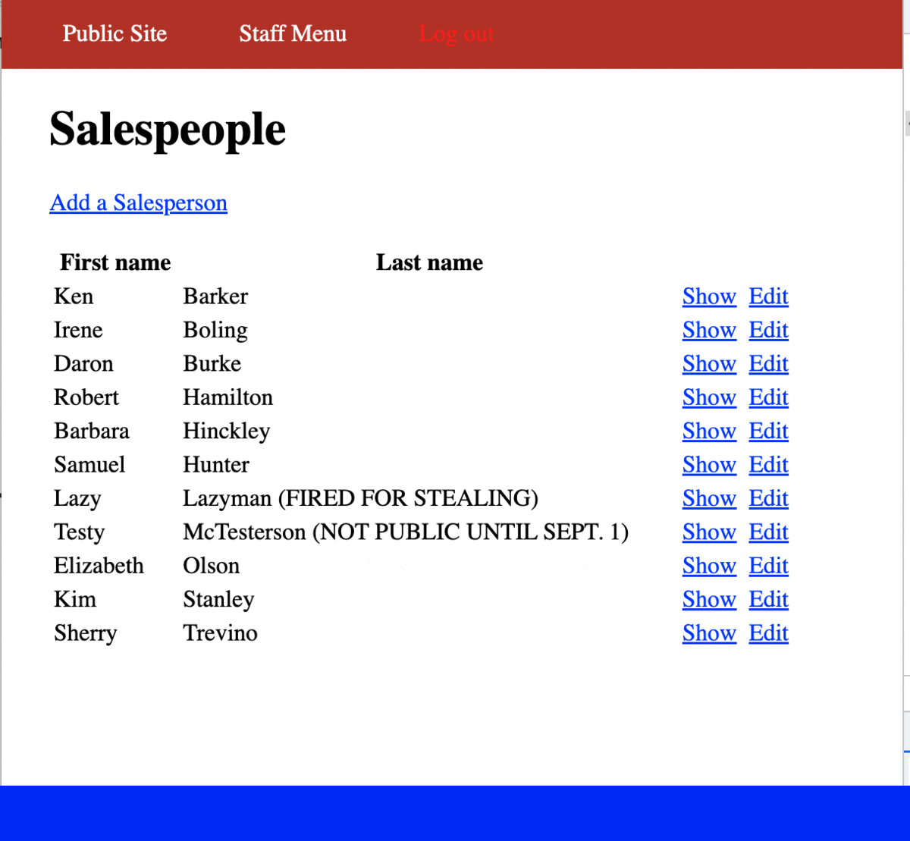

# Pen Testing Live Targets

Time spent: **6** hours spent in total

> Objective: Identify vulnerabilities in three different versions of the Globitek website: blue, green, and red.

The six possible exploits are:

* Username Enumeration
* Insecure Direct Object Reference (IDOR)
* SQL Injection (SQLi)
* Cross-Site Scripting (XSS)
* Cross-Site Request Forgery (CSRF)
* Session Hijacking/Fixation

Each color is vulnerable to only 2 of the 6 possible exploits. First discover which color has the specific vulnerability, then write a short description of how to exploit it, and finally demonstrate it using screenshots compiled into a GIF.

## Blue

Vulnerability #1: SQL Injection

Description: The URL input is not being sanitized before being used in an SQL query. Through "Blind SQL Injection," an attacker is able to see that this page will accept the SQL injection, ' OR SLEEP(5)=0--'. This SQL query causes the database to return a slower response which tells the attacker that the injection is working.

## Green

Vulnerability #1: Cross-Site Scripting

Description: The feedback form is vulnerable to a stored XSS attack. Injected ) into the feedback form and submitted.

Vulnerability #2: Username Enumeration

Description: The developer unwittingly gives a clue about which usernames are valid and which are invalid by **bolding** "**Log in was unsuccessful**" when the username is valid and leaving "Log in was unsucessful" unbolded when the username is invalid. Now an attacker can tell which usernames are valid or invalid.

## Red

Vulnerability #1: Insecure Direct Object Reference

Description: The Red site allows sensitive information to be made public to users by changing the IDs at the end of the URL, red/public/salesperson.php?id=. Users are able to change the IDs at the end to 10 and 11 and find hidden information for Lazy Lazyman and Testy McTesterson. The green and blue sites don't let users access the IDs of 10 and 11, which should remain hidden, and instead redirects requests for private salesperson information back to a public page, Find a Salesperson. 

## Notes

Describe any challenges encountered while doing the work

