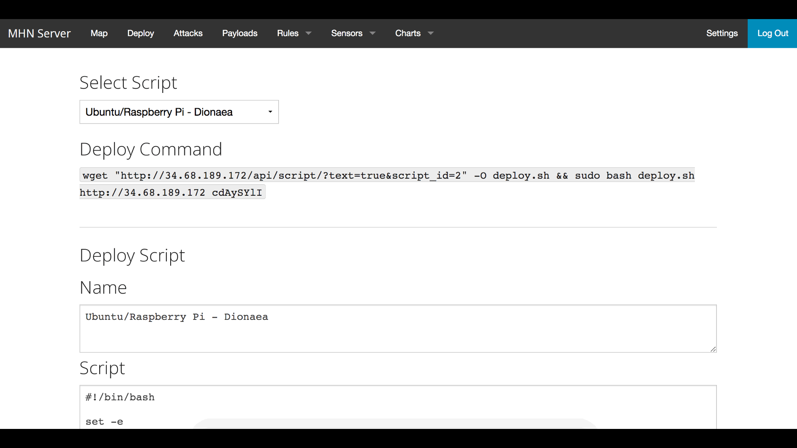
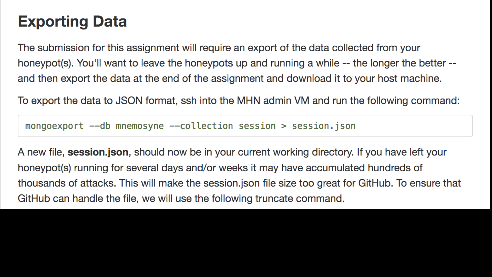

# Honeypot Assignment

**Time spent:** **10** hours spent in total

**Objective:** Create a honeynet using MHN-Admin. Present your findings as if you were requested to give a brief report of the current state of Internet security. Assume that your audience is a current employer who is questioning why the company should allocate anymore resources to the IT security team.

### MHN-Admin Deployment (Required)

**Summary:** How did you deploy it? Did you use GCP, AWS, Azure, Vagrant, VirtualBox, etc.?

I used GCP to deploy MHN-Admin. I established SSH access to the VM using this command ```gcloud compute ssh mhn-admin```. I then installed the MHN Admin Application in order to load the external IP in a browser. I logged into the admin console via the "superuser" login information and password that I chose during the application installation. 


### Dionaea Honeypot Deployment (Required)

**Summary:** Briefly in your own words, what does dionaea do?

dionaea traps malware that is exploiting network vulnerabilities and tries to get a copy of the malware.



### Database Backup (Required) 

**Summary:** What is the RDBMS that MHN-Admin uses? What information does the exported JSON file record?

MHN-Admin uses mongoDB as the RDBMS and uses mnemosyne. The exported JSON file contains information about the attacks, including id, protocol, timestamp, source_ip, source_port, destination_port, identifier, and more. 

**session.json has been uploaded directly to this GitHub repo/branch**



*Be sure to upload session.json directly to this GitHub repo/branch in order to get full credit.*

### Deploying Additional Honeypot(s) (Optional)

#### X Honeypot

**Summary:** What does this honeypot simulate and do for a security researcher?


### Malware Capture and Identification (Optional)

#### X Malware

**Summary:** How did you find it? Which honeypot captured it? What does each malware do?

MD5 Hash: *Run `md5sum` on the file and record the hash here.*

SHA1 Hash: *Run `sha1sum` on the file and record the hash here.*


## Notes

I ran into installation issues. My primary laptop has an M1 chip and Python 3.10 and GCP requires Python 3.7-3.9. I tried to figure out how to get an old version of Python and spent several hours on it but it wasn't successful. My old laptop is also running Python 3.10, but it has an Intel chip so I was able to use the GCP installer to also download Python 3.7 (for some reason GCP doesn't install Python 3.7 for M1 chip laptops).
